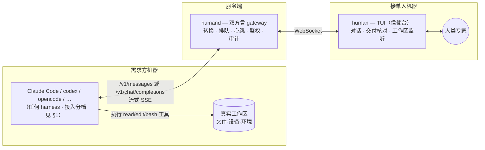

# Human Agent

> 伪装成 AI 的人——把人类专家接入 agent 网络。

**一期（当前为 Pre-P1-M0）：人 = 模型。** Human Agent 的设计目标是暴露 **Anthropic Messages** 与 **OpenAI Chat Completions** 方言的模型端点，并在 P1-M0 实测 Responses API 与具体 harness 的兼容性；当前不承诺已覆盖 Codex 等具体客户端。接入后，harness 发来上下文，人通过 TUI 读懂现场后自然地干活，对方机器上的 harness 照常执行——读文件、改代码、跑命令（adb、测试、部署）都在需求方的真实现场发生，只是决策者是人。

接入分三档（[02](docs/02-gateway.md) §1）：**Chat**（改一行 base_url，纯对话）、**Remote tools**（+ harness adapter + caller shim/等价边界，注入稳定身份并为 read/edit/exec 去重）、**Workspace**（+ caller helper，本地 IDE 镜像研发）。"一行配置"只属于 Chat 档。一期聚焦**环境绑定型排障**（adb/内网/现场），长研发档是否承诺由 P1-M0 长挂结果裁决。

TUI 是**沟通与交付的信使台**,不是逐回合扮演模型的驾驶舱:真正的研发在**接单人自己的 IDE** 里进行（Claude Code、cursor、手写皆可）,TUI 只管读懂需求（对话形态）、干完后核对改动放行交付。中间几十个 tool-call 回合不暴露给人,人面对任务级节奏。文件隐式——工作目录被后台监听,改动自动汇成交付 diff。因此"人用自己的 AI 干活、自己当监工"是天然默认。

## 为什么一期选"人当模型"

设计过程中反复出现同一模式：文件就地变化、实时同步、远程命令（adb）、执行授权、Esc 中断、Esc Esc 回滚、排队——**每一项在这个形态下都由对方 harness 免费提供**（它们本来就是 harness 的原生能力，我们只是替换了模型）。人看到的是需求方机器的真实现场（harness 的工具在那里执行），"两侧一致性"从 git 全局问题**缩小为逐 tool-call 确认**。工程量因此比 agent 形态小一个数量级。完整决策记录见 [01](docs/01-goals.md)。

**二期：人 = Agent**（A2A 异步派单、worktree 深度工作、diff 交付）。协议核心经 TLA+ **有限状态模型检查**（[formal/](formal/)），归档于 [docs/phase2-async-mode.md](docs/phase2-async-mode.md)。

## 组件（一期两件套）

| 组件 | 职责 |
|---|---|
| `humand` | 双方言 gateway：方言互转、准入/流式两阶段、跨回合任务状态机、心跳/长挂、显式 adapter、稳定标识、默认安全审计（SQLite） |
| `human` | 接单人 TUI（信使台）：请求队列、需求对话（含流式进度/澄清）、工作区后台监听、交付核对、环境命令、通知；研发在接单人自己 IDE |

## 文档

| 文档 | 内容 |
|---|---|
| [01 目标与一期定义](docs/01-goals.md) | 最终目标、双模式定位与决策记录、场景、功能点、非目标 |
| [02 Gateway 设计](docs/02-gateway.md) | 接入三档、双方言与 canonical、准入/流式两阶段、跨回合状态机、adapter、默认安全、路径围栏 |
| [03 TUI 规格](docs/03-tui.md) | 信使台信息架构、对话/交付核对、工作区镜像、键位、关键流程 |
| [04 里程碑](docs/04-milestones.md) | P1-M0 可裁决门 → P1-M2、阈值与产品门、验收 demo、backlog |
| [05 P1-M0 契约](docs/05-p1-m0-contract.md) | 可执行契约：身份三层、adapter 握手、循环状态机+幂等、拒单时序、read/search+CAS |
| [phase2-async-mode.md](docs/phase2-async-mode.md) | 二期"人 = Agent"完整设计归档（单篇，含 [formal/](formal/) TLA+ 验证） |

## 状态

一期设计完成（已按 codex review 修订 6 项 P0）。下一步 **P1-M0**：可裁决的兼容性 + 产品实验（1–2 周，go/no-go 硬门，见 [04](docs/04-milestones.md)）。技术栈：Go（gateway 与 TUI，Bubble Tea）。
