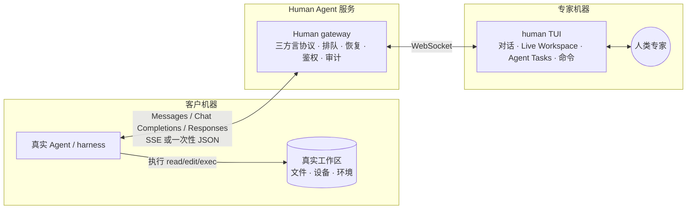

# Human Agent

> 让客户侧真实 Agent 像调用 LLM 一样调用人类专家。

**技术形态固定：人占据 LLM / 模型协议的位置；业务边界不在这里设限。** 客户侧的真实 Agent / harness 继续负责上下文编排、权限与工具循环；Human Agent 兼容 **Anthropic Messages、OpenAI Chat Completions 与 OpenAI Responses**，把模型请求交给人，再把人的判断按请求模式以 SSE 或一次性 JSON 返回。只要客户 Agent 能用其原生工具表达，编码、排障、评审、运维或其它任务都可以走同一协议闭环。

**Live Workspace 是核心能力，不是后续附加项。** 人在自己的镜像目录保存文件后，`fsnotify` 会触发一次新的完整 review；默认仍需 preview/confirm，开启 `--workspace-auto-send` 后，change-level 无安全警告、无冲突的改动会自动进入同一交付路径。Human 只生成客户 Agent CLI 已声明的原生 `edit/write` tool call；命令与计划分别走 `bash` 和 Tasks 工具；执行结果由客户 Agent 在下一次 completion 回流，TUI 再续接同一任务。客户工作树始终是唯一真相，Human 侧不直接挂载或执行客户机器。

当前 Go 实现已有三种方言的流式与聚合 codec、持久任务循环、worker WebSocket、caller shim、Live Workspace 与聊天式 TUI 闭环，并配有仓库内测试和脱敏 golden fixtures。TUI 基于官方 [Bubble Tea v2](https://github.com/charmbracelet/bubbletea)（`charm.land/bubbletea/v2`），并使用 [Bubbles](https://github.com/charmbracelet/bubbles)（`charm.land/bubbles/v2`）与 [Lip Gloss](https://github.com/charmbracelet/lipgloss)（`charm.land/lipgloss/v2`）组织输入、滚动和自适应布局。**OpenCode 1.17.18 + OpenAI-compatible Chat** 已在隔离 Git 工作区真实跑通文本 SSE、同一响应内的多 tool call、`write → edit → bash → todowrite → final` 多轮闭环；精确的 `opencode@1.17.18` Workspace profile 还以真实 CLI 进程跑通 `空 Human mirror → :pull 精确字节 → mirror edit → 原生 edit/result 对账 → bash + todowrite → final → 同一 OpenCode session 在 terminal 后的下一 user turn 新建 Human task`。10 分钟和 2 小时持续流只保留为历史证据，不再作为门禁。当前门禁是**网络不稳定与服务异常恢复**：仓库内故障注入已覆盖 caller 同 key 连续 5 次断开后精确续传、caller 保持 TCP 但停止读取 SSE 时按单次写入超时释放 handler、worker 冷启动时 gateway 离线后恢复、5 次 WebSocket 抖动与半开连接、gateway/SQLite 重启，以及 caller、worker、gateway 三方同时掉线后的项目内部 request/event/outbox exactly-once 恢复；Workspace 专项还覆盖三方重叠离线期间持久排队原生 edit、gateway/SQLite 与 worker outbox 重启、并发 caller 重放、result continuation 和 save-ahead diff 保留。

**Codex CLI 0.144.4 的重试策略已做真实黑盒捕获**：服务端返 500，或读完 POST 后直接断 TCP，CLI 都显示 `Reconnecting 1/5…5/5`，两组捕获端各收到 30 个 POST。它不发 `Idempotency-Key`，但 `User-Agent: codex_exec/<version>` 与 `X-Codex-Turn-Metadata` 里的用户 turn UUID 在 retry 与同 turn 工具循环内稳定。gateway 因此仅为严格识别的 **Basic/Chat + Responses + Codex turn** 派生请求幂等 key；显式 key 始终优先，该适配不授予 Remote tools/Workspace 能力，可用 `human gateway --disable-codex-auto-idempotency` 立即关闭。仓库内测试证明 5 次断流第 6 次恢复，以及 30 个并发 + 1 个顺序重放仍只有 1 个 task/assignment 且 wire 逐字节相同。这只证明当前 Codex profile 的重试身份与 gateway 去重，不等于完整 Codex gateway/tool 兼容。

**Codex CLI 0.144.5 的 Responses 原生工具闭环也已用真实进程跑通**：隔离的空 `CODEX_HOME` 与 `--ignore-user-config --ephemeral` 下，首轮请求声明串行工具策略、普通 `exec_command`、namespace functions 和 provider-hosted `web_search`；Human 返回一个 `exec_command`，Codex 实际执行后在第二轮用同一 `call_id` 回传 `function_call_output`，再收到 Human final 并正常退出。namespace 始终以 `(namespace, name)` 作为正确性身份，hosted capability 只提示“由 client/provider 执行”，不会伪装成 Human 可调用函数。该 gate 证明 Basic/Chat + Responses 的文本/函数循环，不授予 Codex Workspace、Tasks 或 Live Workspace profile。

三个 completion 端点均支持 `stream:true` 与 `stream:false`。非流式请求沿同一 canonical worker 状态机聚合，但不把 SSE 再解析成 JSON：终态时原子持久化 HTTP status + 完整 body，随后一次性返回，并逐字节幂等重放。它没有应用层 heartbeat，长挂体验仍以流式模式为主。Responses 接受显式串行/并行策略、普通与 namespace functions、typed reasoning history 以及已识别的 provider-hosted capability；reasoning 私有状态只以 SHA-256 参与请求身份，不进入聊天或 worker state。指定/强制工具、结构化输出、非空 `previous_response_id`、非空顶层 reasoning 配置及未知控制字段会 fail-closed，不会被静默忽略。具体边界见 [Gateway 设计](docs/02-gateway.md#2-三方言端点)。

completion gateway、caller shim 与 worker WebSocket 使用同一个 `8 MiB` application-message budget。raw HTTP body 通过第一层限制后，gateway 仍会在持久准入前精确编码完整 worker assignment；若 canonical/tool schema/JSON 转义使其无法装入 WS，则直接返回 `413 request_too_large`，不会留下已落库但永远无法派发的任务。worker event 也在进入 durable outbox 前执行同一检查。

活跃请求的 canonical 与响应事件会为崩溃恢复和精确幂等暂存；请求完成后默认保留 24 小时，可用 `human gateway --replay-payload-grace <duration>` 调整。grace 后正文被裁成无正文幂等 tombstone：同 key/摘要重放返回 `410 replay_payload_expired`，异摘要仍返回 `409`。这条 correctness 留存与默认关闭、开启后默认 TTL 7 天的 audit payload 是两套独立策略。

接入契约有三种能力档（[02](docs/02-gateway.md) §1），不是业务阶段：**Basic**（base_url + token，文本和本次请求声明的原生 tools）、**Workspace**（版本化 harness profile + 稳定 workspace/task 身份 + caller root，把镜像改动映射为 Agent CLI 原生工具并续接结果）、**Remote tools**（自有 shim/等价边界，提供持久执行 ledger、强 CAS 与 realpath/symlink 围栏，也可承载同一 mirror 体验）。“一行配置”只属于 Basic；增强档按 harness 边界选择，不要求先传完整仓库或另建执行系统。



## 为什么选择“人当模型”

客户侧已经有一个真实 Agent。它原生拥有文件读写、命令执行、权限确认、取消重试与界面流式能力；Human Agent 只替换它调用的模型，不再并行维护另一套任务委托、代码传输和执行系统。

因此文件改动和命令始终由客户侧 Agent 在真实现场执行。Basic 把 completion 独立处理；exact Workspace 用 harness 原生 session 把 Live mirror、工具结果与多个 completion 续起来；只有需要持久执行 ledger、强 CAS 与 realpath/symlink 围栏时才叠加 Remote tools/shim。shim 的 `.git` 禁写不是只看输入字符串：解析内部符号链接后还会对真实相对路径再检查，`alias -> .git` 无法借 write/edit/delete/rename 写入 hooks 或其它仓库元数据。

## 运行形态与代码边界

gateway 是协议与持久正确性的**逻辑组件**。`human local` 把 gateway、SQLite 与 TUI 放进同一进程；远程、团队或多个专家部署才拆成 `human gateway` 与 `human worker`。项目未发布，不保留第二套 daemon 命令或裸 worker 入口。

| 组件 | 职责 |
|---|---|
| `human local` | 内嵌 gateway、SQLite、loopback HTTP 与 TUI；本机 OpenCode/Codex/Claude 的默认入口 |
| `human gateway` | 独立 gateway；由部署方控制监听、反向代理和用户系统，适合远程、团队和多 worker |
| `human worker` | 只连接远程 gateway 的专家 TUI；官方客户端自动处理重连、outbox 与 worker instance identity |
| `human shim` | 可选的需求方执行边界，提供稳定身份、强 CAS、路径围栏与持久执行 ledger |

核心领域仍位于 `internal/completion/`，对外可复用入口位于 `gateway`、`worker` 和 `local` 三个公共 Go package；CLI 只负责配置、listener 与进程信号。

### Go 库嵌入

`gateway.Open` 不占用 TCP 端口，返回 `http.Handler`，也可分别取 `ModelHandler()` 与 `WorkerHandler()` 挂到现有 router。宿主可用完整 HTTP request 实现 Cookie、JWT、mTLS 或上游注入身份；`WorkerRouter` 再用已认证 caller、model、capability tier、workspace/task/harness 身份把**新任务**绑定到准确的 worker subject。该 owner 在准入时持久化，后续 continuation 与崩溃恢复不再重路由，因而宿主可以直接实现 tenant → 专家池隔离。策略拒绝、路由器故障和已选 worker 离线分别 fail-closed，不会静默掉回其它专家。使用自定义认证时，内建 token 签发会明确禁用，避免出现两套身份真相。使用内建 token 时，`ValidateToken` 可在复用持久凭据前核对 type/subject/key ID，`RevokeToken` 只有在 secret 与预期 key ID 同属一条凭据时才吊销，适合安全轮换。当前公共持久实现诚实限定为 SQLite，没有把内部 store 类型伪装成稳定 driver API。

```go
config := gateway.DefaultConfig()
config.DatabasePath = "/var/lib/human/human.db"
config.Authenticator = gateway.AuthenticatorFunc(func(r *http.Request) (gateway.Principal, error) {
    // 从现有 session / JWT / mTLS / request context 解析租户身份。
    // 进入协议正确性命名空间的 SubjectID/KeyID 必须是最长 128 字节的稳定 key：
    // [A-Za-z0-9][A-Za-z0-9._:-]*；复杂上游身份应先映射为稳定 opaque ID。
    return gateway.Principal{Type: gateway.PrincipalCaller, SubjectID: "tenant-user"}, nil
})
config.WorkerRouter = gateway.WorkerRouterFunc(func(ctx context.Context, in gateway.WorkerRouteRequest) (string, error) {
    // in.Request 保留原 headers/context，并提供可重新读取的完整 request body。
    if in.Caller.SubjectID != "tenant-user" { return "", gateway.ErrWorkerRouteDenied }
    return "expert-team-a", nil // 必须是已认证 worker 的精确 SubjectID
})

humanGateway, err := gateway.Open(ctx, config)
if err != nil { /* handle */ }
defer humanGateway.Close()
mux.Handle("/human/", http.StripPrefix("/human", humanGateway.ModelHandler()))
mux.Handle("/internal/human-worker", humanGateway.WorkerHandler())
```

`worker.Open` 暴露 `Model() tea.Model` 与 `Run`，可把官方 TUI 嵌进更大的 Bubble Tea 程序；`local.Open` 则组合 loopback listener、gateway、SQLite 和 worker。自行实现 worker WebSocket 时必须为同一进程的所有重连复用稳定的 `X-Human-Worker-Instance`；同一 worker 身份同时只允许一个 instance 活跃，challenger 不顶替 incumbent，而是等待旧连接释放。官方 worker 库会自动维护这套行为。

## 文档

| 文档 | 内容 |
|---|---|
| [01 目标与产品定义](docs/01-goals.md) | 产品定位、决策记录、场景、功能点与非目标 |
| [02 Gateway 设计](docs/02-gateway.md) | 接入三档、三方言、两阶段错误、跨回合状态机、adapter、默认安全与路径围栏 |
| [03 TUI 规格](docs/03-tui.md) | 信息架构、对话/进度、工作区镜像、交付核对与关键流程 |
| [04 里程碑](docs/04-milestones.md) | M0 可裁决门、垂直切片、可靠性门与验收 demo |
| [05 M0 契约](docs/05-m0-contract.md) | 身份边界、adapter 握手、循环状态机与幂等、拒单时序、read/search 与 CAS |
| [06 产品 TODO](docs/06-product-todos.md) | 已完成、本轮待验收与后续真实 harness 工作，不把本机适配当外部兼容 |

## OpenCode 本机演练

已实测版本为 OpenCode `1.17.18`。下面是 **Workspace 档**配置；放到工作区自己的 `opencode.json`（或等价 provider 配置）并把两个占位值替换为稳定工作区名与客户工作区的绝对路径。token 只从环境变量读取，不要把真实 token 写进配置或提交到仓库：

```jsonc
"human": {
  "npm": "@ai-sdk/openai-compatible",
  "name": "Human Agent (local)",
  "options": {
    "baseURL": "http://127.0.0.1:19080/v1",
    "apiKey": "{env:HUMAN_CALLER_TOKEN}",
    "timeout": false,
    "headers": {
      "X-Human-Capability-Tier": "workspace",
      "X-Human-Workspace-Key": "my-project",
      "X-Human-Harness-Id": "opencode",
      "X-Human-Harness-Version": "1.17.18",
      "X-Human-Workspace-Root": "/absolute/path/to/customer/workspace",
      "X-Human-Allow-Exec": "true"
    }
  },
  "models": {
    "human-expert": { "name": "Human Expert" }
  }
}
```

本机只需先启动一条命令；首次启动会签发 caller/worker 凭据并写入 mode `0600` 的 `.human/local-credentials.json`，以后复用同一 SQLite 与同一凭据：

```sh
go run ./cmd/human local \
  --listen 127.0.0.1:19080 \
  --workspace-auto-send
```

需要轮换时使用 `--reset-credentials`。local 会先把 prepared pair 写入同一 mode-`0600` journal，再激活并切换 active，最后撤销旧 pair；进程在任一边界退出后，下次启动会继续未完成步骤，而不会先吊销唯一可用凭据。

当前项目尚未发布，gateway、worker outbox/state 与 caller ledger 只接受各自唯一的当前 schema，不包含迁移器。若从本轮之前的开发库启动，会明确返回 `unsupported ... schema; recreate database`；请连同相应的本地 credentials journal 一起重建，而不是尝试混用旧库。

在运行客户 Agent 的另一个终端读取 caller token（不会进入 argv），再启动 OpenCode：

```sh
export HUMAN_CALLER_TOKEN="$(go run ./cmd/human local credentials --token-only)"
HUMAN_CALLER_TOKEN="$HUMAN_CALLER_TOKEN" opencode --model human/human-expert
```

需要远程拆分时，分别使用 `human gateway` 与 `human worker`；worker token 应通过 `HUMAN_GATEWAY_TOKEN` 或配置文件传入，不要放在 `--token` argv。OpenCode 1.17.18 会为主会话发送 `X-Session-Id`。精确 profile 先以 `session + model/system + 截止最新 user 消息的 canonical 历史` 生成 candidate task；若同一 caller/workspace/exact harness/session 已有唯一非终态 task，则复用现有 task 覆盖 candidate。这样 clarification → followup → tool call → result continuation 始终粘在同一任务；只有任务进入 terminal 后，下一条顶层 user 消息才采用新 candidate。每个完整请求的 retry key 独立由 `caller/workspace/harness session + canonical digest + 完整 JSON 语义摘要` 派生，**不含可变 task_id**，同一请求重试复用原 key。精确 OpenCode 的**无工具**标题/摘要辅助请求会清空 task/workspace、隔离为 Chat，但仍保留 exact transport retry 去重；只要请求声明了任意工具就仍可进入 Workspace。adapter 只映射自己登记的工具语义，并不是阻断其它 caller-declared tools 的全局 allowlist；但在 exact Workspace/Remote tools 中，只有 mapped/已审 standard 工具默认可发，command/network/sub-agent 等 privileged 工具及未分类 custom/MCP 工具必须显式设置 `X-Human-Allow-Exec: true`。这个现有 header 当前承载的是 active caller-tool opt-in，不会绕过客户 Agent 自己的权限确认。

TUI 是单屏四区：`CHAT / REPLY / TASKS / COMMAND`，请求队列只作为轻量 `INBOX` 提示。首次请求在 Tasks 焦点按 `a` 接单（`r` 拒单），随后自动聚焦 Reply。直接输入后，`Enter` 发送一个 progress 段并保持人工回合，可连续回复；`Ctrl+J` 换行（终端支持增强键盘时也可 `Shift+Enter`），`Ctrl+R` 把 clarification/handoff 交还 Agent，`Ctrl+D` 发送 final 并结束。

- `Tab / Shift+Tab`：在 Reply、Command、Tasks 间切换；输入框聚焦时 `a/q/t/x` 都是普通文字，只有 `Ctrl+C` 全局退出。
- Tasks：只显示客户 Agent 的任务计划，与 Human 的请求队列无关。`n` 新增、`Enter/e` 编辑、`Space` 切换状态、`p` 切优先级、`d` 删除，`Ctrl+S` 通过 caller 本轮声明的计划工具发送全量列表；没有兼容工具或 schema 漂移时只读禁用。当前只有 OpenCode 1.17.18 的 `todowrite` 已有真实 fixture/闭环；Claude `TodoWrite`、Codex `update_plan` 只是本机 matcher/仓库测试，尚不能宣称会同步其真实 Tasks 视图。
- Command：只有 caller 本轮明确声明兼容 `bash`，或 Remote adapter 明确授权 exec 时才启用；输入命令后 `Enter` 生成 tool call，由客户 Agent 执行，不会在专家机器本地执行。精确 OpenCode Workspace 可输入 `:pull path/to/file`，通过其原生 `bash` 权限闸运行 `opencode debug file read --pure`，以 base64 精确字节播种该文件；空文件可 hydrate，前导 `-` 路径会转为安全的 `./-...` positional。pull result 连同整个请求仍受统一 `8 MiB` wire budget 限制，过大就 fail-closed，不承诺 `16 MiB` 文件；危险词法命中要求第二次 `Enter` 确认。
- `t`：Tasks 焦点下打开高级声明工具输入；一行一个 `<tool-name> <JSON object>`，`Ctrl+S` 一次发送多个调用。

工具调用会结束当前 completion。Remote tools / Workspace 档下，客户 Agent 带着稳定身份和匹配的 `tool_call_id` 发来下一请求时，TUI 会从当前或最多 32 个已停放 continuation 中续接；默认 `~/.human/worker-state.db` 还会跨 TUI 重启恢复未完成 continuation 与 Reply/Tasks/Command 草稿。镜像保存会由 watcher 自动刷新 review；未开启 `--workspace-auto-send` 时仍需 `Ctrl+P → Enter` 预览确认。开启后也只有完整 review 中 change-level 安全级别均为 allow、没有被跳过或因 adapter 缺能力而留待处理的改动才自动发送；部分可交付批次必须人工确认。每次交付会在进入 outbox 前持久绑定 exact tool-call ID 与已审内容；等待 result 时即使人又保存了更新草稿，成功 result 也只推进到已发送版本，更新 diff 仍留在 Review 等下一次交付。OpenCode 原生工具缺少 remote SHA/CAS 的 adapter warning 会展示但不会单独阻断这项显式 opt-in；安全 warning/block、基线冲突、跳过项与不可交付改动仍停下来等人。长上下文用 `PgUp/PgDn` 浏览，`v` 查看完整 system、工具目录和 schema。

## 状态

completion 核心与 Live Workspace 主链已经落地。OpenCode 1.17.18 的 Basic/Chat 原生工具循环和 exact Workspace 的 `空镜像 → :pull → edit/result → bash/tasks → final → 同 session terminal 后下一 user turn` 均已用真实 CLI 验收。`X-Session-Id + 最新 user 历史` 先产生 candidate task；同一 exact harness session 存在非终态 task 时一律续用它，terminal 后才释放给下一 candidate。请求级 retry key 绑定 harness session 与完整请求摘要，不绑定最终选中的 task。普通 OpenCode `read` 仍是带行号的有损展示文本，不能用于 byte-exact hydrate，但 `:pull` 已通过 `opencode debug file read --pure` + base64 提供显式的逐文件精确 bootstrap；空文件与前导 `-` 路径已覆盖，它不是整仓同步，且仍受 `8 MiB` 整体 wire budget 约束。原生 edit/write 仍没有 remote SHA/CAS 或 shim ledger，外部编辑器直接修改客户工作树也不会主动推送给 Human，须显式 `:pull` 或等后续 result/read 路径重新观察。Codex 0.144.4 的响应前 retry 黑盒和 0.144.5 的 Responses Basic 工具闭环均已通过；仍缺 Codex partial-SSE 恢复与 Workspace/Tasks/Live Workspace。Claude 仍只有本机 schema/codec 测试；真实 OpenCode partial-SSE/掉线恢复与完整 TUI 手工体验也待外部验收。下一步只跑剩余真实 harness 网络/服务异常矩阵，不再追加更长挂门；明细见 [06](docs/06-product-todos.md)。
