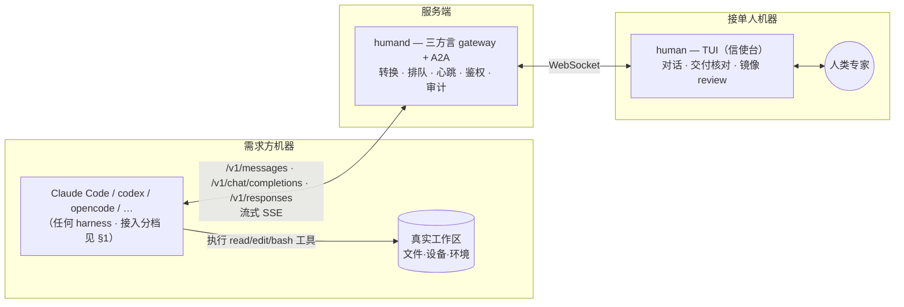

# Human Agent

> 伪装成 AI 的人——把人类专家接入 agent 网络。

**一期同步模式：人 = 模型。** 当前 Go 实现已暴露 **Anthropic Messages、OpenAI Chat Completions 与 OpenAI Responses** 三种流式 codec，并实现持久任务循环、worker WebSocket、caller shim、镜像与最小 TUI 闭环。三种 codec 有仓库内测试与脱敏 golden fixtures；但真实外部 harness 的兼容矩阵、10 分钟/2 小时长挂尚未执行，因此当前不承诺已覆盖 Codex、Claude Code 等具体客户端。接入后，harness 发来上下文，人通过 TUI 读懂现场后自然地干活，对方机器上的 harness 照常执行——读文件、改代码、跑命令（adb、测试、部署）都在需求方的真实现场发生，只是决策者是人。

接入契约分三档（[02](docs/02-gateway.md) §1）：**Chat**（改一行 base_url，纯对话）、**Remote tools**（+ harness adapter + caller shim/等价边界，注入稳定身份并为 read/edit/exec 去重）、**Workspace**（目标再加 caller helper、snapshot/base_commit 与完整镜像；当前只实现镜像/review 原型，完整字段契约尚未落地）。"一行配置"只属于 Chat 档。一期聚焦**环境绑定型排障**（adb/内网/现场），长研发档是否承诺由 P1-M0 长挂结果裁决。

TUI 是**沟通与交付的信使台**,不是逐回合扮演模型的驾驶舱:真正的研发在**接单人自己的 IDE** 里进行（Claude Code、cursor、手写皆可）,TUI 只管读懂需求（对话形态）、干完后核对改动放行交付。中间几十个 tool-call 回合不暴露给人,人面对的是任务级节奏。当前实现由人按 `R` 扫描镜像目录并生成待核对 diff；后台 fsnotify 自动汇总仍是后续体验项。因此"人用自己的 AI 干活、自己当监工"是天然默认。

## 为什么一期选"人当模型"

设计过程中反复出现同一模式：文件就地变化、实时同步、远程命令（adb）、执行授权、Esc 中断、Esc Esc 回滚、排队——**每一项在这个形态下都由对方 harness 免费提供**（它们本来就是 harness 的原生能力，我们只是替换了模型）。人看到的是需求方机器的真实现场（harness 的工具在那里执行），"两侧一致性"从 git 全局问题**缩小为逐 tool-call 确认**。工程量因此比 agent 形态小一个数量级。完整决策记录见 [01](docs/01-goals.md)。

**二期异步模式：人 = Agent**（A2A 异步派单、worktree 深度工作、diff 交付）。`delegation` 状态权威、官方 A2A JSON-RPC/HTTP+JSON、worker 协议、worktree/rewind、累计 patch、caller 侧 `human-mcp` apply 与显式授权的 remote exec 已实现，并有仓库内端到端测试；协议核心另经 TLA+ **有限状态模型检查**（[formal/](formal/)）。这仍不等于外部 harness 试点或产品门已经通过，细节见 [docs/phase2-async-mode.md](docs/phase2-async-mode.md)。

## 代码边界与组件

领域包按长期语义命名：同步“人 = 模型”核心在 `internal/completion/`，异步“人 = Agent”核心在 `internal/delegation/`；不使用 `phase1/phase2` 作为包名。

| 组件 | 职责 |
|---|---|
| `humand` | 三方言 completion gateway + A2A 服务：准入/流式两阶段、两套持久状态权威、Bearer 鉴权、SQLite 审计、completion/delegation worker WebSocket |
| `human` | 接单人入口：completion TUI，以及异步 delegation 的 watch/tasks/accept/deliver/rewind/complete 等 CLI 流程 |
| `human-mcp` | 需求方本地 MCP：异步派单、状态/回复/取消、累计 patch 校验与 apply；remote exec 默认不注册，需 caller 侧显式开启并逐条 approve/deny |

## 文档

| 文档 | 内容 |
|---|---|
| [01 目标与一期定义](docs/01-goals.md) | 最终目标、双模式定位与决策记录、场景、功能点、非目标 |
| [02 Gateway 设计](docs/02-gateway.md) | 接入三档、三方言与 canonical、准入/流式两阶段、跨回合状态机、adapter、默认安全、路径围栏 |
| [03 TUI 规格](docs/03-tui.md) | 信使台信息架构、对话/交付核对、工作区镜像、键位、关键流程 |
| [04 里程碑](docs/04-milestones.md) | P1-M0 可裁决门 → P1-M2、阈值与产品门、验收 demo、backlog |
| [05 P1-M0 契约](docs/05-p1-m0-contract.md) | 可执行契约：身份三层、adapter 握手、循环状态机+幂等、拒单时序、read/search+CAS |
| [phase2-async-mode.md](docs/phase2-async-mode.md) | 二期"人 = Agent"设计与当前实现边界（含 [formal/](formal/) TLA+ 验证） |

## 状态

两期核心代码与仓库内自动化闭环已经落地；这把项目从“设计稿”推进到“可运行实现”，但没有越过外部验证门。尚未完成的关键证据是：冻结版本的真实 harness 三协议实测、10 分钟/2 小时长挂、8 小时 soak，以及 20 个内部真实任务的成功率/未授权命令/静默文件错误产品门。下一步仍是按 [04](docs/04-milestones.md) 执行这些实验，而不是继续扩写协议。
