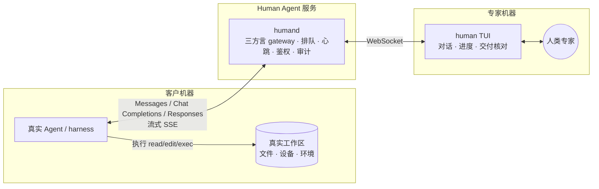

# Human Agent

> 让客户侧真实 Agent 像调用 LLM 一样调用人类专家。

**唯一产品形态：人 = 动态 LLM。** 客户侧的真实 Agent / harness 继续负责上下文编排和工具循环；Human Agent 兼容 **Anthropic Messages、OpenAI Chat Completions 与 OpenAI Responses**，把模型请求交给人，再把人的判断以对应协议流式返回。读文件、改代码、运行 adb、测试和部署仍发生在客户机器上，只是下一步由人类专家决定。

当前 Go 实现已有三种流式 codec、持久任务循环、worker WebSocket、caller shim、工作区镜像与最小 TUI 闭环，并配有仓库内测试和脱敏 golden fixtures。冻结版本的真实外部 harness 兼容矩阵、10 分钟/2 小时长挂仍未执行，因此目前不承诺已兼容任何具体客户端。

接入契约分三档（[02](docs/02-gateway.md) §1）：**Chat**（base_url + token，纯对话）、**Remote tools**（再加 adapter 与 caller shim/等价边界，为 read/edit/exec 提供稳定身份和去重）、**Workspace**（目标再加 caller helper、snapshot/base_commit 与完整镜像；当前只有镜像/review 原型）。“一行配置”只属于 Chat 档。当前优先验证环境绑定型排障；长研发体验是否成立，由 M0 的真实长挂结果裁决。

## 为什么选择“人当模型”

客户侧已经有一个真实 Agent。它原生拥有文件读写、命令执行、权限确认、取消重试与界面流式能力；Human Agent 只替换它调用的模型，不再并行维护另一套任务委托、代码传输和执行系统。

因此文件改动和命令始终由客户侧 Agent 在真实现场执行，正确性问题收敛为逐次 tool-call 的确认与幂等。服务端仍需持久化跨 completion 的任务、lease、响应事件和 tool result 对账，确保长等待、重试与重启不会重复执行或静默丢失。

## 代码边界与组件

核心领域位于 `internal/completion/`；目录名表达产品语义，不使用阶段编号。

| 组件 | 职责 |
|---|---|
| `humand` | 三方言 completion gateway：准入/流式两阶段、持久状态、队列、Bearer 鉴权、SQLite 审计与 worker WebSocket |
| `human` | 专家侧 TUI；`human shim` 作为客户侧可信边界，注入稳定身份并为 read/edit/exec 提供 CAS 与持久去重 |

## 文档

| 文档 | 内容 |
|---|---|
| [01 目标与产品定义](docs/01-goals.md) | 产品定位、决策记录、场景、功能点与非目标 |
| [02 Gateway 设计](docs/02-gateway.md) | 接入三档、三方言、两阶段错误、跨回合状态机、adapter、默认安全与路径围栏 |
| [03 TUI 规格](docs/03-tui.md) | 信息架构、对话/进度、工作区镜像、交付核对与关键流程 |
| [04 里程碑](docs/04-milestones.md) | M0 可裁决门、垂直切片、可靠性门与验收 demo |
| [05 M0 契约](docs/05-m0-contract.md) | 身份边界、adapter 握手、循环状态机与幂等、拒单时序、read/search 与 CAS |

## 状态

completion 核心代码与仓库内自动化闭环已经落地，但尚未越过外部验证门。下一步是冻结目标 Agent / harness 版本，完成三协议实测、10 分钟/2 小时长挂、8 小时 soak，以及 20 个真实任务的成功率、未授权命令和静默文件错误产品门。
