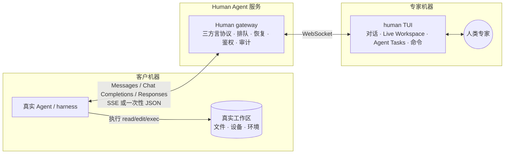

# Human Agent

> 让人直接成为 Agent 可调用、可恢复、可交付 Workspace 结果的协作者。

Human 不按编码、排障、评审、运维等业务场景设限，而是提供两种技术形态。**HumanLLM 是人占据 LLM / 模型协议的位置**：兼容 **Anthropic Messages、OpenAI Chat Completions 与 OpenAI Responses**，让客户侧真实 Agent / harness 继续负责上下文、权限和工具循环。**HumanAgent 是 durable Task/Message/Submission/Artifact**：适合可暂停、多轮询问和最终打包交付。两者共享内容与 Workspace 语义，但不是同一个公开状态机。

**Live Workspace 是核心能力，不是后续附加项。** 人在自己的镜像目录保存文件后，`fsnotify` 会触发一次新的完整 review；默认仍需 preview/confirm，开启 `--workspace-auto-send` 后，change-level 无安全警告、无冲突的改动会自动进入同一交付路径。Human 只生成客户 Agent CLI 已声明的原生 `edit/write` tool call；命令与计划分别走 `bash` 和 Tasks 工具；执行结果由客户 Agent 在下一次 completion 回流，TUI 再续接同一任务。客户工作树始终是唯一真相，Human 侧不直接挂载或执行客户机器。

当前 Go 实现已有三种方言的流式与聚合 codec、持久任务循环、worker WebSocket、caller shim、Live Workspace 与聊天式 TUI 闭环；同时新增 transport-neutral `llm.Service`，把 Store、Caller/Worker Transport、Codec、Protector/KMS、路由与授权做成公共 port。官方 SQLite/HTTP/WebSocket/AEAD 只是可替换 adapter，完整自定义装配见 [`examples/custom-framework`](examples/custom-framework/README.md)。TUI 基于官方 [Bubble Tea v2](https://github.com/charmbracelet/bubbletea)（`charm.land/bubbletea/v2`），并使用 [Bubbles](https://github.com/charmbracelet/bubbles)（`charm.land/bubbles/v2`）与 [Lip Gloss](https://github.com/charmbracelet/lipgloss)（`charm.land/lipgloss/v2`）组织输入、滚动和自适应布局。**OpenCode 1.17.18 + OpenAI-compatible Chat** 已在隔离 Git 工作区真实跑通文本 SSE、同一响应内的多 tool call、`write → edit → bash → todowrite → final` 多轮闭环；精确的 `opencode@1.17.18` Workspace profile 还以真实 CLI 进程跑通 `空 Human mirror → :pull 精确字节 → mirror edit → 原生 edit/result 对账 → bash + todowrite → final → 同一 OpenCode session 在 terminal 后的下一 user turn 新建 Human task`。10 分钟和 2 小时持续流只保留为历史证据，不再作为门禁。可靠性证据分两层：仓库内故障注入覆盖 caller/worker/service/SQLite 或 Memory Store 重启、三方重叠离线、outbox 重放和 Workspace save-ahead；真实 OpenCode 网络门则在 response headers 前、完整 stream-start 后、Human progress 后三个并行场景中，各连续强制断线 5 次，并在第 6 次以相同 body、`X-Session-Id` 与 Human idempotency key 恢复，单轮三个场景约 70 秒。后者证明真实 CLI 的传输重试，不等于任意多进程部署已经自动高可用。

协议演进已经在 TLA+ 中明确拆成两个 surface：completion 产品是实时增量的 **HumanLLM**；独立持久 Task/Context 与最终 Submission/Artifact 的 **HumanAgent** 不等同于 TUI Tasks 工具，也不复用 completion response 充当任务生命周期。根包提供 transport-neutral `human.NewLLM()` / `human.NewAgent()`；HumanAgent 已覆盖多轮消息、终态、Artifact 原子发布、**commit-time 无时钟 lease/fence**、原子 `ClaimLease` 以及独立远程 worker transport/Journal。公共 `a2a` 包提供官方 A2A 1.0 HTTP+JSON caller adapter：认证 principal 决定 Authority，支持 subscribe、stream / `input-required`、多轮续接与 extension negotiation；因 1.0.1 的 proto 与生成规范/官方 Go SDK 对 subscribe 的 GET/POST 定义冲突，handler 接受两者并归一到同一路径。`workspace.Store` port、官方 `workspace/sqlite` adapter 与 A2A apply-receipt extension 已跑通 Artifact 交付垂直切片；真实文件 CAS 仍由宿主 applier 执行。尚未完成的是官方 HumanAgent TUI，以及 LLM/Agent 共用同一条 Workspace revision chain。`HumanAgentTransport` 已纳入共 90 个 formal gate；有限模型的证据边界见 [09 TLA+ 模型与实现约束](docs/09-formal-model.md)。

当前 RC 的可交付目标是 **OpenCode 1.17.18 单机 `human local` 路径**。Codex、Claude、其它 OpenCode 版本、远程多 worker/多租户都是后续扩展证据；它们不阻塞这个明确范围，也不能借已有 codec 或 Basic gate 宣称兼容。

**Codex CLI 0.144.4 的重试策略已做真实黑盒捕获**：服务端返 500，或读完 POST 后直接断 TCP，CLI 都显示 `Reconnecting 1/5…5/5`，两组捕获端各收到 30 个 POST。它不发 `Idempotency-Key`，但 `User-Agent: codex_exec/<version>` 与 `X-Codex-Turn-Metadata` 里的用户 turn UUID 在 retry 与同 turn 工具循环内稳定。gateway 因此仅为严格识别的 **Basic/Chat + Responses + Codex turn** 派生请求幂等 key；显式 key 始终优先，该适配不授予 Remote tools/Workspace 能力，可用 `human gateway --disable-codex-auto-idempotency` 立即关闭。仓库内测试证明 5 次断流第 6 次恢复，以及 30 个并发 + 1 个顺序重放仍只有 1 个 task/assignment 且 wire 逐字节相同。这只证明当前 Codex profile 的重试身份与 gateway 去重，不等于完整 Codex gateway/tool 兼容。

**Codex CLI 0.144.5 的 Responses 原生工具闭环也已用真实进程跑通**：隔离的空 `CODEX_HOME` 与 `--ignore-user-config --ephemeral` 下，首轮请求声明串行工具策略、普通 `exec_command`、namespace functions 和 provider-hosted `web_search`；Human 返回一个 `exec_command`，Codex 实际执行后在第二轮用同一 `call_id` 回传 `function_call_output`，再收到 Human final 并正常退出。namespace 始终以 `(namespace, name)` 作为正确性身份，hosted capability 只提示“由 client/provider 执行”，不会伪装成 Human 可调用函数。该 gate 证明 Basic/Chat + Responses 的文本/函数循环，不授予 Codex Workspace、Tasks 或 Live Workspace profile。

三个 completion 端点均支持 `stream:true` 与 `stream:false`。非流式请求沿同一 canonical worker 状态机聚合，但不把 SSE 再解析成 JSON：终态时原子持久化 HTTP status + 完整 body，随后一次性返回，并逐字节幂等重放。它没有应用层 heartbeat，长挂体验仍以流式模式为主。Responses 接受显式串行/并行策略、普通与 namespace functions、typed reasoning history 以及已识别的 provider-hosted capability；reasoning 私有状态只以 SHA-256 参与请求身份，不进入聊天或 worker state。指定/强制工具、结构化输出、非空 `previous_response_id`、非空顶层 reasoning 配置及未知控制字段会 fail-closed，不会被静默忽略。具体边界见 [Gateway 设计](docs/02-gateway.md#2-三方言端点)。

completion gateway、caller shim 与 worker WebSocket 使用同一个 `8 MiB` application-message budget。raw HTTP body 通过第一层限制后，gateway 仍会在持久准入前精确编码完整 worker assignment；若 canonical/tool schema/JSON 转义使其无法装入 WS，则直接返回 `413 request_too_large`，不会留下已落库但永远无法派发的任务。worker event 也在进入 durable outbox 前执行同一检查。

活跃请求的 canonical 与响应事件会为崩溃恢复和精确幂等暂存；请求完成后默认保留 24 小时，可用 `human gateway --replay-payload-grace <duration>` 调整。grace 后正文被裁成无正文幂等 tombstone：同 key/摘要重放返回 `410 replay_payload_expired`，异摘要仍返回 `409`。这条 correctness 留存与默认关闭、开启后默认 TTL 7 天的 audit payload 是两套独立策略。

接入契约有三种能力档（[02](docs/02-gateway.md) §1），不是业务阶段：**Basic**（base_url + token，文本和本次请求声明的原生 tools）、**Workspace**（版本化 harness profile + 稳定 workspace/task 身份 + caller root，把镜像改动映射为 Agent CLI 原生工具并续接结果）、**Remote tools**（自有 shim/等价边界，提供持久执行 ledger、强 CAS 与 realpath/symlink 围栏，也可承载同一 mirror 体验）。“一行配置”只属于 Basic；增强档按 harness 边界选择，不要求先传完整仓库或另建执行系统。



## 为什么 HumanLLM 选择“人当模型”

客户侧已经有一个真实 Agent。它原生拥有文件读写、命令执行、权限确认、取消重试与界面流式能力；HumanLLM 只替换它调用的模型，不再并行维护另一套任务委托、代码传输和执行系统。HumanAgent 是另一条明确的 task surface，不受这条取舍约束。

因此文件改动和命令始终由客户侧 Agent 在真实现场执行。Basic 把 completion 独立处理；exact Workspace 用 harness 原生 session 把 Live mirror、工具结果与多个 completion 续起来；只有需要持久执行 ledger、强 CAS 与 realpath/symlink 围栏时才叠加 Remote tools/shim。shim 的 `.git` 禁写不是只看输入字符串：解析内部符号链接后还会对真实相对路径再检查，`alias -> .git` 无法借 write/edit/delete/rename 写入 hooks 或其它仓库元数据。

## 运行形态与代码边界

`llm.Service` 是新的 HumanLLM transport-neutral 正确性内核；现有 gateway 是面向 CLI/兼容端点的一体化产品 composition，**已定位为 legacy**：新协议与扩展点只落公共内核，RC 后 gateway 将迁移到 `llm.Service` 之上（决策见 [06](docs/06-product-todos.md#架构决策方向性不进入本轮验收)）。在迁移完成前，公共内核的自定义 codec/Store 不会自动出现在 `human local`。`human local` 把 gateway、SQLite 与 TUI 放进同一进程；远程、团队或多个专家部署拆成 `human gateway` 与 `human worker`。HumanAgent 提供可嵌入 Go 领域、A2A caller handler 与独立远程 worker transport，但暂不发布第二套 daemon 或官方 Agent TUI。

| 组件 | 职责 |
|---|---|
| `human local` | 内嵌 gateway、SQLite、loopback HTTP 与 TUI；本机 OpenCode/Codex/Claude 的默认入口 |
| `human gateway` | 独立 gateway；由部署方控制监听、反向代理和用户系统，适合远程、团队和多 worker |
| `human worker` | 只连接远程 gateway 的专家 TUI；官方客户端自动处理重连、outbox 与 worker instance identity |
| `human shim` | 可选的需求方执行边界，提供稳定身份、强 CAS、路径围栏与持久执行 ledger |

HumanLLM 的公共内核与 ports 位于 `llm`，HumanAgent 独立领域位于 `agent`；根 `human` 包提供两个命名 composition root，`llm/callerhttp` 与 `a2a` 分别提供 LLM/Agent caller HTTP adapter。`workspace` 已包含 opaque workspace 值类型与可替换 `workspace.Store`，SQLite 实现在独立的 `workspace/sqlite`；HumanLLM 尚未接入同一全局 revision chain。`gateway`、`worker`、`local` 继续承载现有 HumanLLM CLI 装配；CLI 只负责配置、listener 与进程信号。

### Go 库嵌入

`human.NewLLM` 与 `human.NewAgent` 都不启动 listener，也不隐式创建 SQLite：宿主分别显式注入 `llm.Store` / `agent.Store`；前者还要求 `DeploymentID`，再显式启动 caller/worker transport。官方 `llm/callerhttp` 可挂到现有 mux，并让宿主用 Cookie、JWT、mTLS 或上游 context 实现认证；`WorkerRouter` 用已认证 caller、model、capability tier、workspace/task/harness 身份把新任务绑定到稳定 worker。策略拒绝、路由器故障和已选 worker 离线分别 fail-closed。需要 turnkey token/health/CLI 时仍可使用 `gateway.Open`。`agent/sqlite`、`llm/sqlite`、`workspace/sqlite` 只是官方单机 adapters；自有 PostgreSQL/服务 adapter 可实现对应领域 Store，并分别通过公开的 `humantest.TestAgentStore`、`TestLLMStore`、`TestWorkspaceStore` conformance。

可直接编译运行的 [`custom-framework`](examples/custom-framework/README.md) 展示 `human.NewLLM` + 完全自有的单文件 Store、认证、非 HTTP transport 和 Protector；该 Store 直接运行公开 conformance 与无 `Release` 子进程退出恢复测试，同包另给出 Store middleware 的 owned/borrowed 组合方式。[`embed-local`](examples/embed-local/main.go) 展示一体化 CLI composition；[`embed-gateway`](examples/embed-gateway/main.go) 展示旧 gateway 的自有 mux 与身份路由；[`embed-agent`](examples/embed-agent/main.go) 和 [`embed-a2a`](examples/embed-a2a/main.go) 展示 HumanAgent 领域与 caller adapter。示例里的受信代理 header 只说明扩展点，不是生产认证；生产必须验证代理跳、剥离外部 header 并阻止客户端直达 handler。完整责任边界见 [Go 库嵌入](docs/07-embedding.md)。

`worker.Open` 暴露 `Model() tea.Model` 与 `Run`，可把官方 TUI 嵌进更大的 Bubble Tea 程序；`Worker.Close` 会取消并等待自己启动的活动 `Run`。`local.Open` 则组合 loopback listener、gateway、SQLite 和 worker；库自行签发的临时 caller/worker token 默认随 `Local.Close` 撤销，只有宿主在 `Open` 前显式选择 preserve 并接管两个 secret 的持久化时才保留。自行实现 worker WebSocket 时必须为同一进程的所有重连复用稳定的 `X-Human-Worker-Instance`；同一 worker 身份同时只允许一个 instance 活跃，challenger 不顶替 incumbent，而是等待旧连接释放。官方 worker 库会自动维护这套行为。

## 文档

| 文档 | 内容 |
|---|---|
| [01 目标与产品定义](docs/01-goals.md) | 产品定位、决策记录、场景、功能点与非目标 |
| [02 Gateway 设计](docs/02-gateway.md) | 接入三档、三方言、两阶段错误、跨回合状态机、adapter、默认安全与路径围栏 |
| [03 TUI 规格](docs/03-tui.md) | 信息架构、对话/进度、工作区镜像、交付核对与关键流程 |
| [04 里程碑](docs/04-milestones.md) | M0 可裁决门、垂直切片、可靠性门与验收 demo |
| [05 M0 契约](docs/05-m0-contract.md) | 身份边界、adapter 握手、循环状态机与幂等、拒单时序、read/search 与 CAS |
| [06 产品 TODO](docs/06-product-todos.md) | 已完成、本轮待验收与后续真实 harness 工作，不把本机适配当外部兼容 |
| [07 Go 库嵌入](docs/07-embedding.md) | `human.NewLLM/NewAgent`、LLM/Agent Store/Transport/Protector ports、完整自定义装配、旧 CLI composition 与生命周期 |
| [08 部署与运维](docs/08-operations.md) | 远程 TLS/WSS 接入、token 生命周期、真实故障门、本机升级/回滚及拆分部署灾备边界 |
| [09 TLA+ 模型与实现约束](docs/09-formal-model.md) | HumanLLM/HumanAgent 双 surface、共享 runtime/workspace、故障与活性假设、模型到 Go 的 refinement obligations |
| [10 Human Framework 扩展合同](docs/10-framework-contract.md) | 正确性内核与 ports/adapters、Store 原子性、Transport、Protector、资源所有权和 conformance 约束 |

## 安装

从 [GitHub Releases](https://github.com/vibe-agi/human/releases) 选择当前平台归档，用同一 Release 的 `checksums.txt` 校验 SHA-256 后，把 `human`（Windows 为 `human.exe`）放入 `PATH`。归档同时包含 README、完整 docs 与供宿主项目复制的嵌入示例；安装后先运行 `human version --json` 核对版本和 commit。源码开发者也可以在仓库根目录使用 `go run ./cmd/human ...`，下文统一写安装后的 `human ...`。升级、失败回滚和卸载必须先保存旧 binary 与 verified local archive；当前 v0.x clean-break schema 没有迁移器，完整步骤见 [08 部署与运维](docs/08-operations.md#安装升级回滚与卸载)。

## OpenCode 本机演练

已实测版本为 OpenCode `1.17.18`。先用 onboarding 命令核对本机环境并生成完整配置；`doctor` 中“尚未启动 gateway / 尚无首次凭据 / gateway ready 但暂时没有在线 worker”只记 WARN，恢复未完成或 SQLite 不可查询等真正的 readiness 错误才返回非零。`init` 默认只写 stdout，不会改客户仓库；只有显式给 `--output` 才原子写文件，已存在时还必须再给 `--force`：

```sh
human doctor --workspace . --require-opencode
human init opencode --workspace .
```

生成内容使用真实 Git workspace root 的稳定摘要作为 `workspace_key`，不会把路径塞进 key；caller token 始终是 `{env:HUMAN_CALLER_TOKEN}` 引用，配置文件不含 secret。下面是同一份 **Workspace 档**配置的结构示例；也可以把生成结果显式写到你选择的 OpenCode 配置文件：

```jsonc
"human": {
  "npm": "@ai-sdk/openai-compatible",
  "name": "Human Agent (local)",
  "options": {
    "baseURL": "http://127.0.0.1:19080/v1",
    "apiKey": "{env:HUMAN_CALLER_TOKEN}",
    "timeout": false,
    "headers": {
      "X-Human-Capability-Tier": "workspace",
      "X-Human-Workspace-Key": "workspace-<sha256-of-real-workspace>",
      "X-Human-Harness-Id": "opencode",
      "X-Human-Harness-Version": "1.17.18",
      "X-Human-Workspace-Root": "/absolute/path/to/customer/workspace",
      "X-Human-Allow-Exec": "true"
    }
  },
  "models": {
    "human-expert": { "name": "Human Expert" }
  }
}
```

本机只需先启动一条命令；首次启动会签发 caller/worker 凭据并写入 mode `0600` 的用户私有数据目录，以后按 workspace 复用同一 SQLite 与同一凭据。`--workspace` 会先解析 symlink，再向上选择最近的 Git root；没有 Git 时就使用该目录本身：

```sh
human local \
  --workspace . \
  --listen 127.0.0.1:19080
```

默认私有数据根为 macOS 的 `~/Library/Application Support/Human`、Linux 的 `${XDG_DATA_HOME:-~/.local/share}/human`、Windows 的 `%LOCALAPPDATA%\\Human`；也可用绝对路径 `HUMAN_DATA_HOME` 统一覆盖。local 的 gateway DB、credential journal、worker outbox/state 和 shim ledger 都在这个根下按真实 workspace 路径的 SHA-256 隔离，不会再把 `.human` 写进客户 Git workspace。显式 `--db`、`--credentials`、`--outbox`、`--state-db`、`--ledger` 仍完全覆盖自动路径；`--state-db=` 继续表示关闭 TUI 状态持久化。standalone `human gateway` 和 `human worker` 的私有库也使用同一用户数据根。

需要轮换时使用 `--reset-credentials`。local 会先把 prepared pair 写入同一 mode-`0600` journal，再激活并切换 active，最后撤销旧 pair；进程在任一边界退出后，下次启动会继续未完成步骤，而不会先吊销唯一可用凭据。worker outbox 不用 bearer token 作为持久身份，而是在认证成功后按规范化 gateway endpoint + 稳定 worker subject 选取命名空间：同一 subject 换新 token 后仍会补发旧 token 时已落盘但未 ACK 的事件，不同 gateway 或 subject 不能互相重放。

当前 clean-break 发行的 gateway、worker outbox/state 与 caller ledger 只接受各自唯一的当前 schema，不包含迁移器。若从本轮之前的开发库启动，会明确返回 `unsupported ... schema; recreate database`；请连同相应的本地 credentials journal 一起重建，而不是尝试混用旧库。

本机状态可以在 `human local` **完全停止后**做离线备份、校验和恢复；archive 含 gateway SQLite、credential rotation journal、worker outbox/state，以及当前 `workspace_key` 对应的 mirror worktree 与 `.human-state` baseline。同一 caller 的其他 workspace 不进入该 archive：

```sh
install -d -m 0700 ~/Backups
BACKUP="$HOME/Backups/human-local-$(date +%Y%m%d-%H%M%S).tar.gz"
human local --workspace . backup --output "$BACKUP"
human local verify-backup --input "$BACKUP"
```

恢复是独立的故障恢复操作，不要紧接着对刚完成备份的非空 scope 执行。空目标可用 `restore --input "$BACKUP"`；目标已有任何状态时，只有人工核对后才增加 `--force` 做整套替换。

backup/restore 会按 canonical path 排序并同时抢占 gateway、outbox 和启用时 state DB 的 owner lock；运行中的 local、独立 worker 或直接 token 管理不会与其并发写库。三个 SQLite 都在 source、snapshot/staging 和安装后执行 `PRAGMA quick_check`，并用 `VACUUM INTO` 生成自包含快照，所以已提交 WAL/rollback-sidecar 状态不会因只复制主文件而丢失。archive 还把 manifest 的 gateway identity、worker subject 与 outbox/state 中全部 correctness rows 交叉校验，混入另一 gateway/worker 的待发事件或 TUI 状态会 fail-closed。archive 在 Unix 固定为 mode `0600`；Windows 依赖目标目录 ACL。v2 manifest 用固定的 `mirror/workspace` 与 `mirror/state` 表示且只表示所选 workspace，并对每个文件记录 path/type/mode/size/SHA-256；v1 caller-wide archive 会被明确拒绝，不做兼容读取。校验同时拒绝额外项、重复/可移植文件名碰撞、路径穿越、尾随 gzip 数据和超限解压。这里的 SHA/quick-check 只证明 archive 内部结构与内容自洽，不是数字签名或来源认证；archive 含明文 caller/worker token，Unix 上必须始终以 `0600` 放在可信存储，Windows 上必须核验 ACL；攻击者能整体重写的 archive 不会因 `verify-backup` 变可信。mirror 中 symlink/特殊节点不会被跟随，而是逐路径列在 manifest 的 `skipped` 中；它们本来也不属于可交付 mirror 正确性树。

restore 默认拒绝任一非空目标；mirror 目标只包括所选 workspace，因此同一 caller 的非空 sibling 不会阻挡 restore，`--force` 也不会替换或删除它们。`--force` 使用各目标同目录 staging、持久 restore journal 和 old/new rename，整套安装并重新 quick-check 前不会删除旧集。若 gateway DB 换了 canonical path，restore 会在私有 staging 中把 outbox/state 的 transport identity 一起事务重绑，pending/state 不会静默消失。若进程在 rename 边界退出，`human local` 会 fail-closed 拒绝混合状态，保持停止并运行 `human local --workspace . restore --resume`。移动 Git workspace 后恢复必须额外明确给出 `--accept-workspace-mismatch`，caller/worker subject 仍必须与 archive 一致；该开关只适合同一 workspace 搬迁或取证，不会改写旧 in-flight assignment 的 `workspace_key`/root，恢复后必须先审阅旧任务，不能假设旧 edit 已自动指向新路径。完整边界见 [08 部署与运维](docs/08-operations.md#本机离线备份与恢复)。

在运行客户 Agent 的另一个终端读取 caller token（不会进入 argv），再启动 OpenCode：

```sh
export HUMAN_CALLER_TOKEN="$(human local credentials --workspace . --token-only)"
HUMAN_CALLER_TOKEN="$HUMAN_CALLER_TOKEN" opencode --model human/human-expert
```

需要远程拆分时，分别使用 `human gateway` 与 `human worker`；worker token 只能通过 `HUMAN_GATEWAY_TOKEN` 或权限受限的 `--token-file` 传入，CLI 不提供明文 token argv，配置文件也不承载明文 token。OpenCode 1.17.18 会为主会话发送 `X-Session-Id`。精确 profile 先以 `session + model/system + 截止最新 user 消息的 canonical 历史` 生成 candidate task；若同一 caller/workspace/exact harness/session 已有唯一非终态 task，则复用现有 task 覆盖 candidate。这样 clarification → followup → tool call → result continuation 始终粘在同一任务；只有任务进入 terminal 后，下一条顶层 user 消息才采用新 candidate。每个完整请求的 retry key 独立由 `caller/workspace/harness session + canonical digest + 完整 JSON 语义摘要` 派生，**不含可变 task_id**，同一请求重试复用原 key。精确 OpenCode 的**无工具**标题/摘要辅助请求会清空 task/workspace、隔离为 Chat，但仍保留 exact transport retry 去重；只要请求声明了任意工具就仍可进入 Workspace。adapter 只映射自己登记的工具语义，并不是阻断其它 caller-declared tools 的全局 allowlist；但在 exact Workspace/Remote tools 中，只有 mapped/已审 standard 工具默认可发，command/network/sub-agent 等 privileged 工具及未分类 custom/MCP 工具必须显式设置 `X-Human-Allow-Exec: true`。这个现有 header 当前承载的是 active caller-tool opt-in，不会绕过客户 Agent 自己的权限确认。

TUI 是单屏四区：`CHAT / REPLY / TASKS / COMMAND`，请求队列只作为轻量 `INBOX` 提示。首次请求在 Tasks 焦点按 `a` 接单（`r` 拒单），随后自动聚焦 Reply。直接输入后，`Enter` 发送一个 progress 段并保持人工回合，可连续回复；`Ctrl+J` 换行（终端支持增强键盘时也可 `Shift+Enter`），`Ctrl+R` 把 clarification/handoff 交还 Agent，`Ctrl+D` 发送 final 并结束。

- `Tab / Shift+Tab`：在 Reply、Command、Tasks 间切换；输入框聚焦时 `a/q/t/x` 都是普通文字，只有 `Ctrl+C` 全局退出。
- Tasks：只显示客户 Agent 的任务计划，与 Human 的请求队列无关。`n` 新增、`Enter/e` 编辑、`Space` 切换状态、`p` 切优先级、`d` 删除，`Ctrl+S` 通过 caller 本轮声明的计划工具发送全量列表；没有兼容工具或 schema 漂移时只读禁用。当前只有 OpenCode 1.17.18 的 `todowrite` 已有真实 fixture/闭环；Claude `TodoWrite`、Codex `update_plan` 只是本机 matcher/仓库测试，尚不能宣称会同步其真实 Tasks 视图。
- Command：只有 caller 本轮明确声明兼容 `bash`，或 Remote adapter 明确授权 exec 时才启用；输入命令后 `Enter` 生成 tool call，由客户 Agent 执行，不会在专家机器本地执行。精确 OpenCode Workspace 可输入 `:pull path/to/file`，通过其原生 `bash` 权限闸运行 `opencode debug file read --pure`，以 base64 精确字节播种该文件；空文件可 hydrate，前导 `-` 路径会转为安全的 `./-...` positional。pull result 连同整个请求仍受统一 `8 MiB` wire budget 限制，过大就 fail-closed，不承诺 `16 MiB` 文件；危险词法命中要求第二次 `Enter` 确认。
- `t`：Tasks 焦点下打开高级声明工具输入；一行一个 `<tool-name> <JSON object>`，`Ctrl+S` 一次发送多个调用。

工具调用会结束当前 completion。Remote tools / Workspace 档下，客户 Agent 带着稳定身份和匹配的 `tool_call_id` 发来下一请求时，TUI 会从当前或最多 32 个已停放 continuation 中续接；默认用户数据目录中的 `worker-state.db` 还会跨 TUI 重启恢复未完成 continuation 与 Reply/Tasks/Command 草稿。镜像保存会由 watcher 自动刷新 review；未开启 `--workspace-auto-send` 时仍需 `Ctrl+P → Enter` 预览确认。开启后也只有完整 review 中 change-level 安全级别均为 allow、没有被跳过或因 adapter 缺能力而留待处理的改动才自动发送；部分可交付批次必须人工确认。每次交付先把 exact event 写入 worker-state pending row，再把 exact tool-call ID、digest 与已审内容写成 mirror delivery intent，最后以 intent-recorded phase 更新同一 pending row；只有这份精确 phase 已持久化才允许进入 outbox。崩溃恢复后的 pending assignment 按原字节冻结，因为进程无法判断同一 event 是否已在崩溃前进入 durable outbox；replay 若改变任一字段会 fail-closed，不会改写 journal。准备或确认失败时，mirror 会先写入终态 discard tombstone 并清除 intent，再删除 pending row；拒绝 finalizer 完成 cleanup、journal delete 与本地 rejected-inbox 确认前，只阻止同一稳定 task/session scope 生成新 event，无关任务仍可处理。被拒高级工具草稿以 `event_id + 行号` 确定性生成全新 `tool_call_id`，不会复用已 tombstone 的旧 ID。进程在任一已完成的持久边界退出也不会把被放弃的旧 event 复活。等待 result 时即使人又保存了更新草稿，成功 result 也只推进到已发送版本，更新 diff 仍留在 Review 等下一次交付。OpenCode 原生工具缺少 remote SHA/CAS 的 adapter warning 会展示但不会单独阻断这项显式 opt-in；安全 warning/block、基线冲突、跳过项与不可交付改动仍停下来等人。长上下文用 `PgUp/PgDn` 浏览，`v` 查看完整 system、工具目录和 schema。

## 状态

completion 核心与 Live Workspace 主链已经落地。OpenCode 1.17.18 的 Basic/Chat 原生工具循环和 exact Workspace 的 `空镜像 → :pull → edit/result → bash/tasks → final → 同 session terminal 后下一 user turn` 均已用真实 CLI 验收。`X-Session-Id + 最新 user 历史` 先产生 candidate task；同一 exact harness session 存在非终态 task 时一律续用它，terminal 后才释放给下一 candidate。请求级 retry key 绑定 harness session 与完整请求摘要，不绑定最终选中的 task。普通 OpenCode `read` 仍是带行号的有损展示文本，不能用于 byte-exact hydrate，但 `:pull` 已通过 `opencode debug file read --pure` + base64 提供显式的逐文件精确 bootstrap；空文件与前导 `-` 路径已覆盖，它不是整仓同步，且仍受 `8 MiB` 整体 wire budget 约束。原生 edit/write 仍没有 remote SHA/CAS 或 shim ledger，外部编辑器直接修改客户工作树也不会主动推送给 Human，须显式 `:pull` 或等后续 result/read 路径重新观察。Codex 0.144.4 的响应前 retry 黑盒和 0.144.5 的 Responses Basic 工具闭环均已通过；仍缺 Codex partial-SSE 恢复与 Workspace/Tasks/Live Workspace。Claude 仍只有本机 schema/codec 测试；这些扩展不进入当前 OpenCode 单机 RC 的阻塞条件。生产 Bubble Tea TUI 已经用原始键值驱动真实 OpenCode 完成 accept、连续回复、`:pull`、保存/preview/confirm、Tasks、Command 与 final，并连续通过 3 次；auto-send 仍只有内部安全不变量测试。真实 OpenCode 网络门的三个断点现在都已完成“连续 5 次断线、第 6 次恢复”：每次 retry 的 body 与 `X-Session-Id` 相同，gateway 返回同一 Human idempotency key，只有一个 assignment，最终 progress/final 不重复；三个场景并行单轮约 70 秒。Makefile 默认 `REAL_NETWORK_DROPS=5`，release 以 `REAL_COUNT=3` 重复整套门。仍待观察的是真实 caller/worker/gateway 进程恢复顺序和用户可见行为；内部三方矩阵已通过，不能把它改写成真实进程门已过。明细见 [06](docs/06-product-todos.md)。
