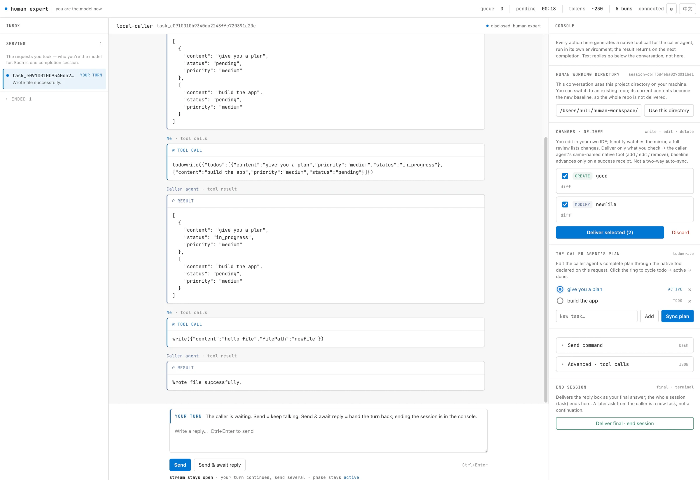
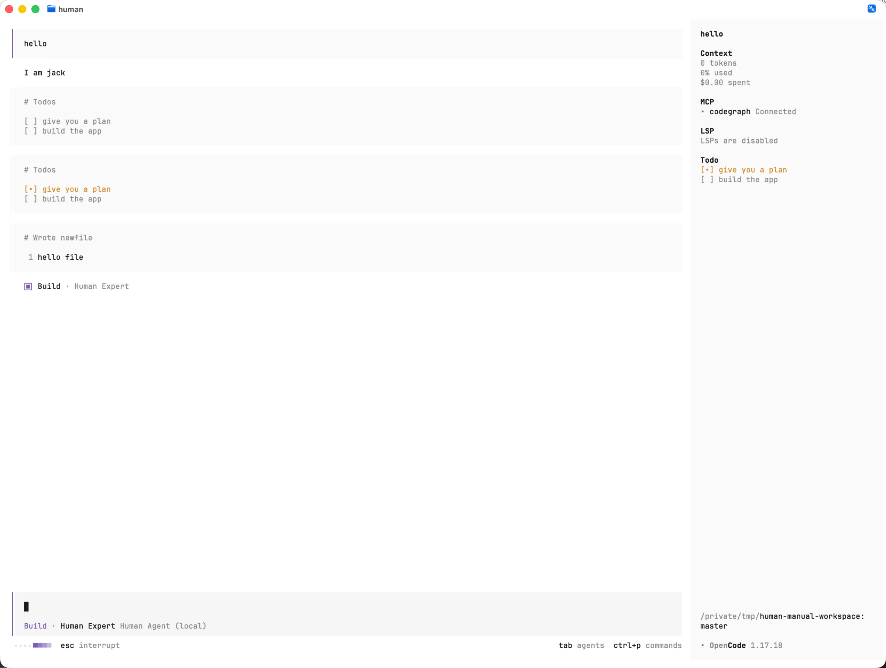

# Human

> The world's slowest LLM. Astonishing reasoning. Terrible latency. Unionized.

An OpenAI/Anthropic-compatible model server where the model is a person.

[简体中文](README.zh-CN.md)

Your coding agent calls `POST /v1/chat/completions` like it always does. The
request shows up in someone's browser. They read it, type an answer, maybe
send back native tool calls for the agent to run in its own workspace, and
hit deliver. The agent gets a normal SSE stream and is none the wiser.

## One request, both sides

The browser is the Human's control room: conversation, native tool calls,
Tasks, and reviewed workspace delivery.

[](docs/assets/screenshots/human-console.webp)

The Agent side stays ordinary. Here OpenCode receives the plan and executes
the file write in its own workspace.

[](docs/assets/screenshots/opencode-caller.webp)

Yes, we know how this sounds. We built an entire idempotent, crash-recovering,
TLA+-verified pipeline so that a human can type "have you tried restarting it"
at 2 tokens per second.

What it verifiably does (real-CLI test doors and all):

- Human-in-the-loop where the human can actually do things: answer, ask back,
  run commands through the agent's own execution gate, edit files in a live
  mirror and deliver them as native `write`/`edit` calls. The working tree
  stays on the agent's side.
- Wizard-of-Oz prototyping: your product doesn't have its AI yet? Ship a
  human. Protocol compatibility means existing agents, harnesses, and clients
  connect unchanged.

Other uses we're not comfortable putting in official documentation, so you'll
have to discover them yourself. For instance: live-demoing "our in-house
foundation model" to a client; taking over a stuck agent at 2am (assuming the
gateway was set up beforehand, not at 2am while reading this README);
recording your own model-seat sessions as evaluation data (it's all in
SQLite, the export tool doesn't exist yet, you know what to do); and, should
the A2A ecosystem ever want to hire an actual human — we happen to have an
endpoint ready.

The plumbing is the serious part: fail-closed everywhere, byte-exact replay,
durable remote-worker journals, 91 formal gates, fault-injection doors that run the real
OpenCode CLI. See [docs/](docs/) if that's your thing.

## Run it

You need Go (or a [release binary](https://github.com/vibe-agi/human/releases)),
a browser, and a human.

```sh
brew install vibe-agi/tap/human
```

Official release binaries and runtime CI currently cover macOS and Linux on
amd64 and arm64. Windows remains compile-checked, but is not yet a supported
runtime: its durable locking, ACL, path, and SQLite contracts do not have the
same evidence, so we do not publish a misleading Windows binary.

```sh
human local --workspace ~/human-workspace
```

It prints the Human-side base working directory followed by two URLs:

```
Human workspace base: /home/human/human-workspace
model base URL: http://127.0.0.1:19080/v1
human side (browser): http://127.0.0.1:19081/?token=...
```

Open the second one. That's your inbox.

`--workspace` is only the base directory on the Human user's machine; it is not
the Agent user's cwd. Every workspace-capable harness session gets a stable
`session-<hash>` child by default. After accepting a request, the Human can
switch that conversation to any existing repo in Web. The repo's current
contents become the baseline, so switching never queues the whole repo for
delivery. Human and Agent only agree that their two directories represent the
same logical project: delivered tool calls use project-relative paths and the
Agent resolves them in its own cwd. Absolute paths need not match and never
cross the model protocol.

Then point an agent at the first one. OpenCode config:

```jsonc
// opencode.json
"human": {
  "npm": "@ai-sdk/openai-compatible",
  "name": "Human",
  "options": {
    "baseURL": "http://127.0.0.1:19080/v1",
    "apiKey": "{env:HUMAN_CALLER_TOKEN}"
  },
  "models": { "human-expert": { "name": "Human Expert" } }
}
```

```sh
export HUMAN_CALLER_TOKEN="$(human local credentials --workspace ~/human-workspace --token-only)"
opencode --model human/human-expert
```

If the Agent and Human are different OS users or machines, transfer the caller
token through a secure channel. The Agent neither needs nor should know the
Human working directory.

Ask it something. Your browser pings. You're the model now — take your time,
the agent will wait.

No agent handy? curl works:

```sh
curl -N http://127.0.0.1:19080/v1/chat/completions \
  -H "Authorization: Bearer $HUMAN_CALLER_TOKEN" \
  -H "Content-Type: application/json" -H "Idempotency-Key: try-1" \
  -d '{"model":"human-expert","stream":true,"messages":[{"role":"user","content":"hello"}]}'
```

The curl hangs until you answer in the browser.

The same local endpoint also serves `POST /v1/responses` and
`POST /v1/messages`. It accepts OpenAI-style `Authorization: Bearer` and
Anthropic-style `X-Api-Key`; conflicting duplicate credentials fail closed.
Wire compatibility is implemented for all three APIs. Harness-level claims are
tracked separately: an API decoding successfully does not imply that every
Workspace or tool feature of every CLI has been validated.

The core wire contract is also exercised through the official Go clients,
currently pinned to `openai-go/v3 v3.37.0` and `anthropic-sdk-go v1.58.1`:
official client serialization enters Human, and the same clients decode its
aggregate responses, SSE text and function/tool calls, tool-result continuations,
standard error envelopes, and Anthropic `count_tokens` response. Compatibility intentionally targets model invocation,
not every provider administration API or provider-hosted tool.

Remote setup is two commands: `human gateway --listen :8080` on a server (put
TLS in front), then `human worker --gateway wss://.../internal/v1/worker/ws
--caller-scope <caller-id> --workspace-scope <opaque-workspace-key>` on the
Human's machine. The scope binds that Human-owned mirror to one authenticated
Agent-user workspace; it is not a directory path.

## Embedding

`human.NewLLM()` / `human.NewAgent()` are transport-neutral cores. Store,
auth, codecs, transports, and KMS are replaceable ports with public
conformance suites in `humantest`; [`examples/custom-framework`](examples/custom-framework/README.md)
runs entirely on its own store, auth, and transport. The web UI is a
stateless projection over the `workerkit` domain layer, so you can replace it
too.

Docs: [goals](docs/01-goals.md), [gateway](docs/02-gateway.md),
[embedding](docs/07-embedding.md), [operations](docs/08-operations.md),
[TLA+ model](docs/09-formal-model.md),
[framework contract](docs/10-framework-contract.md),
[the human-side stack](docs/11-human-side.md).

Status, honestly: all three advertised APIs now have a default product test for
aggregate and streaming calls completed through the Web human API. Real-client
gates give Claude Code 2.1.217, OpenCode 1.17.18, and Codex 0.145.0 the same
baseline: final, second-process session resume, successful caller-side command,
failed command result followed by recovery to final, and bounded Web rejection.
Claude, OpenCode, and Codex additionally prove Workspace create and modify
through their native file tools, with separate Human/Agent directories and
byte-exact caller-side results. Codex uses the Responses `custom` freeform
`apply_patch` tool and receives a Workspace profile only when the request
declares the exact compatible tool and grammar. Through the structured
Web Tasks panel, Claude runs `TaskCreate → TaskUpdate → TaskList`, while OpenCode
`todowrite` and Codex `update_plan` each run pending→in-progress→completed
continuations. The structured Web Command panel likewise uses exact, replaceable
profiles for Claude `Bash`, OpenCode `bash`, and Codex `exec_command`; unknown
versions, missing Codex model metadata, or behavioral schema drift fail closed
to Chat/RemoteTools and the generic declared-tool editor. Claude and Codex also
recover after a forced SSE disconnect following a complete Human progress
frame; that evidence is not extrapolated to Workspace fault recovery.
A separate Testcontainers gate pins all
three CLIs in Linux; its independent direct-protocol layer also calls all three
APIs in aggregate and streaming modes. Both layers route through the host `local`
stack and can use a host OpenAI-compatible model as the Web operator; see the
[operations runbook](docs/08-operations.md#testcontainers-协议直连--三客户端--llm-人类门).
